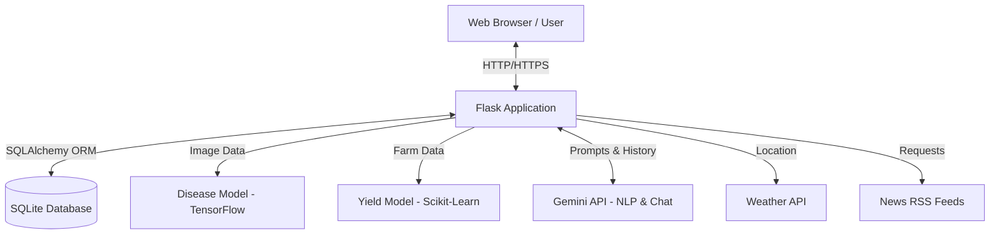
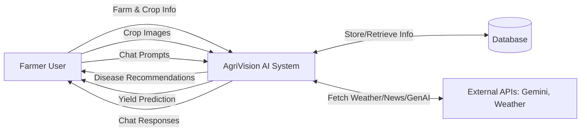
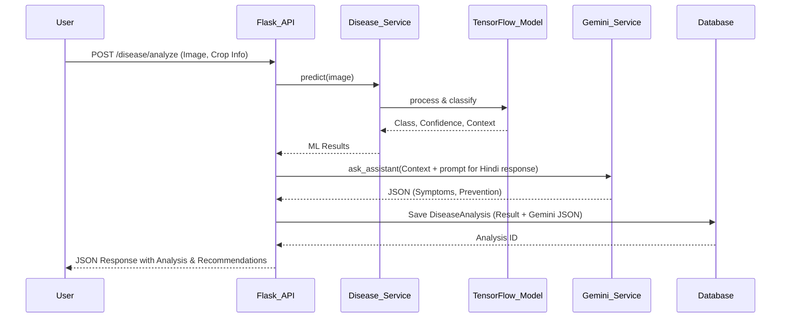

# AgriVision AI

AgriVision AI is a comprehensive web-based platform built with Flask, designed to empower farmers with advanced AI and Machine Learning technologies. It assists in managing farms, monitoring crop health, predicting yields, and obtaining real-time insights through an integrated AI assistant.

## Features

- **Farm & Crop Management**: Register and manage multiple farms, including soil nutrients (Nitrogen, Phosphorus, Potassium), and track crops grown on each farm.
- **Disease Analysis**: Upload images of crops for automated disease detection powered by a custom TensorFlow/Keras model (`disease_model.keras`). Features AI-powered (Gemini) detailed analysis, symptoms, and prevention recommendations provided natively in Hindi for better accessibility.
- **Yield Prediction**: Predict crop yields per acre based on farm area, crop type, and disease severity using scikit-learn machine learning models.
- **AI Assistant Chat**: A conversational AI assistant that helps farmers with queries related to agriculture, powered by the Google Gemini API.
- **Real-Time Weather Integration**: Get localized weather updates for your registered farm locations.
- **Agriculture News**: Stay updated with the latest agricultural news in India.

## Tech Stack

- **Backend Framework**: Python, Flask, Flask-SQLAlchemy, Flask-Login, Flask-Bcrypt, Werkzeug
- **Machine Learning**: TensorFlow (Keras), scikit-learn, NumPy
- **Generative AI**: Google Generative AI (Gemini API)
- **External APIs & Tools**: Requests, Feedparser (for news aggregation)
- **Database**: SQLite (via SQLAlchemy ORM)
- **Server**: Gunicorn

## Core Database Models
- **User**: Handles authentication and links to the user's farms, crops, and histories.
- **Farm**: Stores details like location, area, and soil nutrients (N, P, K).
- **Crop**: Tracks crop types, sowing dates, and expected harvests for each farm.
- **DiseaseAnalysis**: Logs image scan results, ML confidence scores, disease severity, and the parsed JSON recommendations generated by Gemini in Hindi.
- **YieldPrediction**: Stores history of yield predictions.
- **Conversation & ChatMessage**: Stores the conversation history for the AI assistant.

## Project Structure in Detail

```text
AgriVision AI/
│
├── app/
│   ├── static/               # CSS, JS, Images
│   ├── templates/            # HTML Jinja2 templates
│   ├── services/             # Core Business Logic
│   │   ├── disease_service.py
│   │   ├── gemini_service.py
│   │   ├── weather_service.py
│   │   ├── yield_service.py
│   │   └── news_service.py
│   ├── __init__.py           # Flask app factory
│   ├── api.py                # REST API routes
│   ├── main.py               # View routes
│   ├── models.py             # SQLAlchemy models
│   └── auth.py               # Authentication routes
│
├── models/
│   ├── disease_model.keras   # Saved TensorFlow model
│   ├── disease_classes.json  # Class mappings
│   └── disease_metadata.json # Crop/Disease contextual info
│
├── ml/                       # Training scripts / notebooks
├── requirements.txt          # Python dependencies
├── run.py                    # Entry point
└── .env                      # Environment variables (API keys)
```

## System Architecture & Data Flow

### 1. System Architecture



### 2. Data Flow Diagram (DFD - Level 1)



### 3. Low-Level Design (LLD) - Disease Analysis Flow



## Prerequisites

- Python 3.8+
- API Keys for Google Gemini API (for AI assistant and detailed disease explanations)
- API Keys for Weather service (if applicable)

## Installation and Setup

1. **Clone the repository**:
   ```bash
   git clone <repository-url>
   cd "AgriVision AI"
   ```

2. **Create a virtual environment** (recommended):
   ```bash
   python -m venv venv
   # On Windows:
   venv\Scripts\activate
   # On macOS/Linux:
   source venv/bin/activate
   ```

3. **Install the dependencies**:
   ```bash
   pip install -r requirements.txt
   ```

4. **Environment Variables**:
   Create a `.env` file in the root directory of the project and add the necessary environment variables. Example:
   ```env
   SECRET_KEY=your_secret_key_here
   GEMINI_API_KEY=your_gemini_api_key_here
   # Add other required API keys (e.g., Weather API)
   ```

5. **Run the Application**:
   Start the Flask development server by running:
   ```bash
   python run.py
   ```

6. **Access the App**:
   Open your browser and navigate to `http://127.0.0.1:5000/`.
